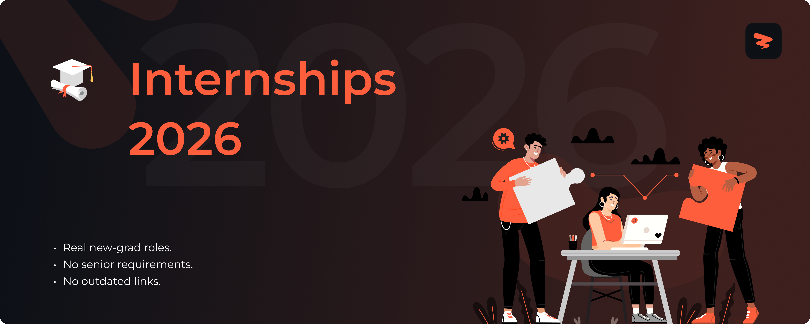

<!-- Banner -->

# Internships 2026

 

<!-- Row 1: Job Stats (Custom Static Badges) -->

🚀 Real-time internships from 6+ top companies like Google, Meta, Amazon, and Microsoft. Updated every 10 minutes with 11+ fresh opportunities for CS students.

🎯 Includes summer internships, fall co-ops, and new graduate programs from tech giants, unicorn startups, and fast-growing companies.

> [!TIP]
> 🛠  Help us grow! Add new jobs by submitting an issue! View [contributing steps](CONTRIBUTING-GUIDE.md) here.

---

## Website & Autofill Extension

Explore Zapply's website and check out:

- Our chrome extension that auto-fills your job applications in seconds.
- A dedicated job board with the latest jobs for various types of roles.
- User account providing multiple profiles for different resume roles.
- Job application tracking with streaks to unlock commitment awards.

Experience an advanced career journey with us! 🚀

  
  &nbsp;&nbsp;&nbsp;&nbsp;
  

---

## Explore Around

Check out what we're doing on our socials, join our community to connect with fellow job seekers, get career advice, keep a lookout for free templates, and stay updated on the latest opportunities.

  
  &nbsp;&nbsp;
  
  &nbsp;&nbsp;
  
  &nbsp;&nbsp;
  
  &nbsp;&nbsp;
  

---

## More Resources

  
  &nbsp;&nbsp;
  
  &nbsp;&nbsp;
  

  
  &nbsp;&nbsp;
  
  &nbsp;&nbsp;
  
  &nbsp;&nbsp;
  

  
  &nbsp;&nbsp;
  

---

## Fresh Internships 2026

### ⭐ **FAANG+** (5 positions)

#### 📦 **Amazon** (1 position)

| Role | Location | Level | Apply Now | Age |
|------|----------|-------|-----------|-----|
| Cloud Support Engineer Internship | Herdon, VA |  |  | 4d |

#### 🟦 **Microsoft** (4 positions)

| Role | Location | Level | Apply Now | Age |
|------|----------|-------|-----------|-----|
| Research Intern - AI Evaluation and Alignment | Redmond, WA |  |  | 16h |
| Data Engineering Intern | Redmond, WA |  |  | 20h |
| Research Intern - AI/ML for Electricity Infrastructure Planning | Redmond, WA |  |  | 1d |
| Data Science | Redmond, WA |  |  | 3d |

### 🏢 **Top Tech** (2 positions)

#### 🎮 **NVIDIA** (2 positions)

| Role | Location | Level | Apply Now | Age |
|------|----------|-------|-----------|-----|
| Performance Engineering Intern - Deep Learning and HPC - Summer 2026 | Santa Clara, CA |  |  | 3d |
| Performance Engineer - Gaming | St. Louis, MO |  |  | 5d |

### 💻 **Enterprise Software** (3 positions)

#### 🌐 **Cisco** (2 positions)

| Role | Location | Level | Apply Now | Age |
|------|----------|-------|-----------|-----|
| Software Engineer Backend/Platform Systems 2 - Intern | Hillsboro, OR |  |  | 16h |
| Software Engineer Full Stack & Application Development 2 – Intern - United States | Hillsboro, OR |  |  | 16h |

#### 🖥️ **Hewlett Packard Enterprise** (1 position)

| Role | Location | Level | Apply Now | Age |
|------|----------|-------|-----------|-----|
| Post Doc Research Associate - Networking and Distributed Systems Lab | Milpitas, CA |  |  | 2d |

### 🏥 **Healthcare & Life Sciences** (1 position)

#### 🔬 **10x Genomics** (1 position)

| Role | Location | Level | Apply Now | Age |
|------|----------|-------|-----------|-----|
| Finance & Data Analytics Intern | Pleasanton, CA |  |  | 5d |

---

## Become a Contributor

Add new jobs to our listings keeping in mind the following:

- Located in the US, Canada, or Remote.
- Openings are currently accepting applications and not older than 1 week.
- Create a new issue to submit different job positions.
- Update a job by submitting an issue with the job URL and required changes.

Our team reviews within 24-48 hours and approved jobs are added to the main list!

Questions? Create a miscellaneous issue, and we'll assist! 🙏

---

<h2>📁 <strong>Archived Internships & New Grad Roles</strong> - 1798 (7+ days old) - Click to Expand</h2>

> Some positions may still be accepting applications or useful for planning.

### **Archived Opportunity Stats**
- **📁 Total Positions**: 1798 roles
- **🏢 Companies**: 244 companies  
- **⭐ FAANG+ Opportunities**: 86 positions

### ⭐ **FAANG+** (84 positions)

#### 📦 **Amazon** (11 positions)

| Role | Location | Level | Apply Now | Age |
|------|----------|-------|-----------|-----|
| Applied Science Intern | Seattle, WA |  |  | 2w |
| 2026 Applied Science Internship - Recommender Systems/ Information Retrieval - Machine Learning | Palo Alto, CA |  |  | 3w |
| Software Development Engineer Internship - Summer 2026 - US | Seattle, WA |  |  | 1mo |
| Amazon Robotics – Applied Scientist 2 Intern / Co-op - 2026 | Seattle, WA |  |  | 1mo |
| 2026 Applied Science Internship - Information & Knowledge Management - Machine Learning | Palo Alto, CA |  |  | 1mo |
| Applied Science Intern - Reinforcement Learning & Optimization - Machine Learning | Palo Alto, CA |  |  | 1mo |
| 2026 Applied Science Internship - Computer Vision - United States | Boston, MA |  |  | 1mo |
| Applied Science Intern - PhD Student Science Recruiting | Seattle, WA |  |  | 1mo |
| Software Development Engineer Internship | Seattle, WA |  |  | 1mo |
| Security Engineer Internship | Seattle, WA |  |  | 1mo |
| Systems Development Engineer Internship | Seattle, WA |  |  | 1mo |

<h4>🟦 <strong>Microsoft</strong> (70 positions)</h4>

| Role | Location | Level | Apply Now | Age |
|------|----------|-------|-----------|-----|
| Software Engineer – Top Secret: Internship Opportunities - Ctj | Redmond, WA |  |  | 1w |
| Software Engineer Applied AI/ML Intern | Washington, Locations |  |  | 1w |
| Research Intern - Machine Learning and Optimization | Cambridge, MA |  |  | 2w |
| Software Engineer: Intern Opportunities for University Students - Mountain View | Mountain View, CA |  |  | 4w |
| Machine Learning Engineer: Intern Opportunities for University Students - Redmond | Redmond, WA |  |  | 4w |
| Research Intern - LLM Performance Optimization | Redmond, WA |  |  | 1mo |
| Software Engineer | Redmond, WA |  |  | 1mo |
| Research Intern - Bio Large Language Models | Redmond, WA |  |  | 1mo |
| Research Intern | Hillsboro, OR |  |  | 1mo |
| Research Intern - Extended Perception Interaction Cognition - Epic | Redmond, WA |  |  | 1mo |
| Research Intern - MSR Inclusive Futures Team | Redmond, WA |  |  | 1mo |
| Research Intern - Office of Applied Research | Redmond, WA |  |  | 1mo |
| Research Intern - AI Frameworks - Network Systems and Tools | Redmond, WA |  |  | 1mo |
| Research Intern - Environmental Policy/Public Policy | Redmond, WA |  |  | 1mo |
| Research Intern - Systems For Efficient AI | Redmond, WA |  |  | 1mo |
| Research Intern - Hardware/Software Codesign | Redmond, WA |  |  | 1mo |
| Research Intern - Foundational Models & Agents | Redmond, WA |  |  | 1mo |
| Research Intern - Computer Vision and Deep Learning | Redmond, WA |  |  | 1mo |
| Research Intern - Data Systems | Redmond, WA |  |  | 1mo |
| Research Intern - AI Hardware | Redmond, WA |  |  | 1mo |
| Research Intern - AI Frontiers - Reasoning & Agentic Models | Redmond, WA |  |  | 1mo |
| Research Intern - Applied Sciences Group - Audio/Vision/NLP/Multimodal | Redmond, WA |  |  | 1mo |
| Research Intern - Algorithms group: Generative Modeling | Redmond, WA |  |  | 1mo |
| Research Intern - LLM Acceleration | Cambridge, MA |  |  | 1mo |
| Research Intern - AI Frameworks | Mountain View, CA |  |  | 1mo |
| Research Intern - AI Agents - Microsoft Research AI Frontiers | Redmond, WA |  |  | 1mo |
| Research Intern - Microsoft Research AI Frontiers | Redmond, WA |  |  | 1mo |
| Research Intern | Cambridge, MA |  |  | 1mo |
| Research Intern - Multimodal Learning | Redmond, WA |  |  | 1mo |
| Research Intern - Microsoft Research Software-Hardware Co-design | Redmond, WA |  |  | 1mo |
| Research Intern - RiSE Group | Redmond, WA |  |  | 1mo |
| Research Intern - Audio and Acoustics | Redmond, WA |  |  | 1mo |
| Research Intern - MSR AI Interaction and Learning | Redmond, WA |  |  | 1mo |
| Research Intern - Machine Learning at MSR NYC | Cambridge, MA |  |  | 1mo |
| Research Intern - Gray Systems Lab - Gsl | Madison, WI |  |  | 1mo |
| Research Intern - Networking Research Group | Redmond, WA |  |  | 1mo |
| Research Intern - Cloud Reliability and Efficiency | Redmond, WA |  |  | 1mo |
| Research Intern - Artificial Intelligence | Redmond, WA |  |  | 1mo |
| Research Intern - AI Agents & Reasoning | Redmond, WA |  |  | 1mo |
| Research Intern - Computer Vision Algorithms | Redmond, WA |  |  | 1mo |
| Research Intern | Kitsap County, WA |  |  | 1mo |
| Research Intern - Machine Learning and Statistics | Cambridge, MA |  |  | 1mo |
| Research Intern - AI Agents | Redmond, WA |  |  | 1mo |
| Research Intern - Multimodal Language Models | Redmond, WA |  |  | 1mo |
| Research Intern - Algorithms Group: Theory | Redmond, WA |  |  | 1mo |
| Research Intern - AI SW/HW Co-design | Hillsboro, OR |  |  | 1mo |
| Research Intern - AI Compiler | Redmond, WA |  |  | 1mo |
| Research Intern - Advanced Memory Systems | Washington, Locations |  |  | 1mo |
| Research Intern - Microsoft Coreai Speech | Redmond, WA |  |  | 1mo |
| Research Intern - Model Optimization and HW Acceleration | Redmond, WA |  |  | 1mo |
| Research Intern - Training Methods for LLM Efficiency | Mountain View, CA |  |  | 1mo |
| Research Intern | Redmond, WA |  |  | 1mo |
| Research Intern - Machine Learning and Optimization | Redmond, WA |  |  | 1mo |
| Research Intern - Microsoft Research Special Projects | Cambridge, MA |  |  | 1mo |
| Research Intern - Neural Rendering & Character AI - Applied Science | Redmond, WA |  |  | 1mo |
| Research Intern - Human Intelligence | Redmond, WA |  |  | 1mo |
| Research Intern - Technology for Religious Empowerment | Redmond, WA |  |  | 1mo |
| Research Intern - Deep Learning Group | Redmond, WA |  |  | 1mo |
| Research Intern - AI/ML Numerics & Efficiency | Redmond, WA |  |  | 1mo |
| Research Intern - AIP AI Knowledge Multimodal AI | Redmond, WA |  |  | 1mo |
| Research Intern - Interactive Multimodal Futures Group - Situated & Affective Computing | Cambridge, MA |  |  | 1mo |
| Research Intern - Multimodal Deep Learning for Healthcare | Redmond, WA |  |  | 1mo |
| Research Intern - AI Network Observability | Redmond, WA |  |  | 1mo |
| Research Intern - Microsoft Teams | Redmond, WA |  |  | 1mo |
| Research Intern - Onedrive and Sharepoint | Redmond, WA |  |  | 1mo |
| Research Intern - AI-Driven CPU Optimizations | Hillsboro, OR |  |  | 1mo |
| Research Intern - Multiple Teams | Redmond, WA |  |  | 1mo |
| Research Internship – Computing | Redmond, WA |  |  | 1mo |
| Data Engineer Intern | Redmond, Washington |  |  | 1mo |
| Software Engineering Intern | Redmond, WA |  |  | 1mo |

#### 🔵 **Meta** (2 positions)

| Role | Location | Level | Apply Now | Age |
|------|----------|-------|-----------|-----|
| Research Scientist Intern, LLM Evaluation | New York, NY |  |  | 1mo |
| Research Scientist Intern, Computational Chemist | Redmond, WA |  |  | 1mo |

#### 🟢 **Google** (1 position)

| Role | Location | Level | Apply Now | Age |
|------|----------|-------|-----------|-----|
| Software Engineering Intern | Atlanta, GA |  |  | 1mo |

### 🏢 **Top Tech** (18 positions)

#### 🎮 **NVIDIA** (12 positions)

| Role | Location | Level | Apply Now | Age |
|------|----------|-------|-----------|-----|
| AI Factory Digital Twin R&D Intern | Santa Clara, CA |  |  | 3w |
| AI Factory Cooling R&D Intern | Santa Clara, CA |  |  | 3w |
| AI Compiler Intern | Santa Clara, CA |  |  | 1mo |
| Autonomous Vehicles and Robotics Intern | Santa Clara, CA |  |  | 1mo |
| Systems Software Engineering Intern | Santa Clara, CA |  |  | 1mo |
| Deep Learning Intern | Santa Clara, CA |  |  | 1mo |
| PhD Autonomous Vehicles Research | Santa Clara, CA |  |  | 1mo |
| PhD Computer Vision and Deep Learning Research | Santa Clara, CA |  |  | 1mo |
| Software Engineering | Santa Clara, CA |  |  | 1mo |
| NVIDIA Internships: PhD Graphics and Simulation Research | Santa Clara, CA |  |  | 1mo |
| NVIDIA 2026 Internships: PhD Generative AI Research | Santa Clara, CA |  |  | 1mo |
| Internships: Deep Learning | Santa Clara, CA |  |  | 1mo |

#### 🔷 **Intel** (1 position)

| Role | Location | Level | Apply Now | Age |
|------|----------|-------|-----------|-----|
| Software Engineering Intern | Hillsboro, OR |  |  | 1mo |

#### 🔶 **AMD** (1 position)

| Role | Location | Level | Apply Now | Age |
|------|----------|-------|-----------|-----|
| Software Engineering Intern | Austin, TX |  |  | 1mo |

#### ☁️ **Salesforce** (3 positions)

| Role | Location | Level | Apply Now | Age |
|------|----------|-------|-----------|-----|
| Summer 2025 Intern - Software Engineer (Security/Government) | Bellevue, WA |  |  | 1mo |
| Intern - AI Research | Palo Alto, CA |  |  | 1mo |
| Salesforce AI Research | Palo Alto, CA |  |  | 1mo |

#### 🔵 **IBM** (1 position)

| Role | Location | Level | Apply Now | Age |
|------|----------|-------|-----------|-----|
| AI Engineer Intern | Austin, TX |  |  | 1mo |

### 💻 **Enterprise Software** (20 positions)

#### 🌐 **Cisco** (9 positions)

| Role | Location | Level | Apply Now | Age |
|------|----------|-------|-----------|-----|
| Software Engineer 2 – Co-op - United States | Boston, MA |  |  | 1w |
| Software Engineer 2 | San Jose, CA |  |  | 1mo |
| AI Research Scientist 1 - Intern | San Jose, CA |  |  | 1mo |
| AI Research Scientist PhD – Intern - United States | San Jose, CA |  |  | 1mo |
| Software Engineer Data/AI/Intelligent Systems PhD Intern | Boston, MA |  |  | 1mo |
| Software Engineer 1 - Intern | Boston, MA |  |  | 1mo |
| Software Engineer Data/AI/Intelligent Systems 1 - Intern | Boston, MA |  |  | 1mo |
| AI Machine Learning Engineer 2 - Intern | San Jose, CA |  |  | 1mo |
| AI Machine Learning Engineer 1 - Intern | San Jose, CA |  |  | 1mo |

#### 🖥️ **Hewlett Packard Enterprise** (11 positions)

| Role | Location | Level | Apply Now | Age |
|------|----------|-------|-----------|-----|
| Hpe Labs – Intern - AI Research Lab Research Associate | Milpitas, CA |  |  | 1mo |
| HPE Labs - Machine Learning Research Associate | Milpitas, CA |  |  | 1mo |
| Research Associate Intern - Networking and Distributed Systems Lab | Milpitas, CA |  |  | 1mo |
| AI/ML Intern | San Jose, CA |  |  | 1mo |
| Hpe Labs – Intern - Emerging Accelerators Research Associate | Milpitas, CA |  |  | 1mo |
| HPE Labs - AI Research Lab Research Associate (Intern) | Milpitas, CA |  |  | 1mo |
| AI Developer Intern - Masters | Houston, TX |  |  | 1mo |
| AI Developer Intern - Undergrad | Houston, TX |  |  | 1mo |
| AI Customer Engagement Analyst Intern | Andover, MA |  |  | 1mo |
| Cloud Engineer Intern | Spring, TX |  |  | 1mo |
| Software Engineering Intern | Spring, TX |  |  | 1mo |

### 🚀 **Startups & Growth** (17 positions)

#### 🛡️ **BAE Systems** (12 positions)

| Role | Location | Level | Apply Now | Age |
|------|----------|-------|-----------|-----|
| Summer Software Intern | Fort Wayne, IN |  |  | 1mo |
| Software Intern, Summer 2026 | Totowa, NJ |  |  | 1mo |
| Software Engineering Intern – Internal Tools 2026 (hybrid) | Cedar Rapids, IA |  |  | 1mo |
| Software Engineering Intern, Summer 2026 | Fort Worth, TX |  |  | 1mo |
| Software Engineering Intern I, Summer 2026 | Nashua, NH |  |  | 1mo |
| Software Engineering Intern II, Summer 2026 | Nashua, NH |  |  | 1mo |
| Software Engineering Intern III, Summer 2026 | Nashua, NH |  |  | 1mo |
| Software Engineering Intern IV, Summer 2026 | Nashua, NH |  |  | 1mo |
| Software or Computer Engineering Co-op | Sterling Heights, MI |  |  | 1mo |
| Software or Computer Engineering Intern | Sterling Heights, MI |  |  | 1mo |
| Software Engineering Intern | San Diego, CA |  |  | 1mo |
| Software Engineering CO-OP | San Diego, CA |  |  | 1mo |

#### 📊 **Guidehouse** (1 position)

| Role | Location | Level | Apply Now | Age |
|------|----------|-------|-----------|-----|
| Intern – AI & Data - Technology | McLean, VA |  |  | 1w |

#### ⚙️ **General Dynamics** (4 positions)

| Role | Location | Level | Apply Now | Age |
|------|----------|-------|-----------|-----|
| Software Engineering Intern | Canonsburg, PA |  |  | 1mo |
| Intern Software Engineer - Embedded Posted Date | Orlando, FL |  |  | 1mo |
| Software Engineer – Intern Conversion | Herndon, VA |  |  | 1mo |
| Intern Engineer | Fort Wayne, IN |  |  | 1mo |

### 🛒 **Consumer & E-Commerce** (5 positions)

#### 🚙 **RIVIAN** (5 positions)

| Role | Location | Level | Apply Now | Age |
|------|----------|-------|-----------|-----|
| Software Engineering – Summer 2026 Internships | Palo Alto, CA |  |  | 1mo |
| Artificial Intelligence – Summer 2026 Internships - Machine Learning & Data Science | Palo Alto, CA |  |  | 1mo |
| Computer Vision Software Intern | Palo Alto, CA |  |  | 1mo |
| Software Engineering Intern - Connected Systems - Summer 2026 | Palo Alto, CA |  |  | 1mo |
| Software Engineering Intern - Applications - Infotainment & Mobile | Palo Alto, CA |  |  | 1mo |

### 🛡️ **Defense & Aerospace** (19 positions)

<h4>🚗 <strong>Waymo</strong> (19 positions)</h4>

| Role | Location | Level | Apply Now | Age |
|------|----------|-------|-----------|-----|
| Intern - ML Training Infra and Efficiency | Mountain View, CA |  |  | 1mo |
| 2026 Summer Intern, MS/PhD, Software Engineer, Planner Reasoning ML/DL | Mountain View, CA |  |  | 1mo |
| 2026 Summer Intern, PhD, Software Engineer, Predictive Planner ML/DL | Mountain View, CA |  |  | 1mo |
| 2026 Summer Intern - MS/PhD - Systems Engineer - Rider Comfort | Mountain View, CA |  |  | 1mo |
| 2026 Summer Intern - PhD - ML Compilers | Mountain View, CA |  |  | 1mo |
| 2026 Summer Intern - MS/PhD - Software Engineer - Predictive Planner Research | Mountain View, CA |  |  | 1mo |
| 2026 Summer Intern - MS/PhD - Compute - Compiler | Mountain View, CA |  |  | 1mo |
| 2026 Summer Intern - PhD - Software Engineer - Planning/Prediction | Mountain View, CA |  |  | 1mo |
| Software Engineering, Fleet Response | San Francisco, CA |  |  | 1mo |
| 2026 Summer Intern - PhD - Software Engineer - Strategic Selection | Mountain View, CA |  |  | 1mo |
| 2026 Summer Intern - PhD - Software Engineer - Due | Mountain View, CA |  |  | 1mo |
| Intern - Research - Multimodal Large Language Models | Mountain View, CA |  |  | 1mo |
| Intern - Research - 3D/4D Scene Reconstruction and Understanding | Mountain View, CA |  |  | 1mo |
| Intern - Research - Perception Foundation Models | Mountain View, CA |  |  | 1mo |
| Software Engineering, Commercialization | Mountain View, CA |  |  | 1mo |
| 2026 Summer Intern - PhD - Perception Semantics | Mountain View, CA |  |  | 1mo |
| Intern - PhD - Machine Learning Engineer - Simulation | Mountain View, CA |  |  | 1mo |
| Machine Learning Infra Foundations | Mountain View, CA |  |  | 1mo |
| 2026 Summer Intern - PhD - Perception - Computer Vision/Deep Learning | Mountain View, CA |  |  | 1mo |

### 🏭 **Manufacturing & Industrial** (23 positions)

#### ⚗️ **Applied Materials** (1 position)

| Role | Location | Level | Apply Now | Age |
|------|----------|-------|-----------|-----|
| 2026 Summer – Plasma Products Modeling Physicist/Scientist Intern - PhD - Santa Clara, CA | Santa Clara, CA |  |  | 1mo |

#### 💾 **Micron Technology** (10 positions)

| Role | Location | Level | Apply Now | Age |
|------|----------|-------|-----------|-----|
| Intern – IT Software Engineer - Ea Eps | Boise, ID |  |  | 1w |
| Intern IT Software Engineer | Boise, ID |  |  | 1w |
| Intern – Data Science | San Jose, CA |  |  | 1w |
| Intern Computer Engineer - AI/LLM | Boise, ID |  |  | 3w |
| Intern – AI/ML Algorithms - Silicon Systems AI | San Jose, CA |  |  | 1mo |
| Intern – System Software Engineering | Richardson, TX |  |  | 1mo |
| Process Control Engineer Intern | Boise, ID |  |  | 2w |
| Intern – HBM Software Engineer | Richardson, TX |  |  | 1mo |
| Intern – Product Yield Analysis and Analytics - Research | Boise, ID |  |  | 1mo |
| Intern – TPG Global IE | Boise, ID |  |  | 1mo |

#### ⚡ **ABB** (5 positions)

| Role | Location | Level | Apply Now | Age |
|------|----------|-------|-----------|-----|
| IS Salesforce.com Agile Delivery Intern-Summer 2026 | Morrisville, NC |  |  | 1mo |
| Software Engineering Intern | Morrisville, NC |  |  | 1mo |
| Software Engineering Intern- Summer 2026 | Bartlesville, OK |  |  | 1mo |
| AI Vision Engineer Intern- AI Robotics | San Jose, CA |  |  | 1mo |
| Data and Analytics Intern - Summer 2026 | Morrisville, NC |  |  | 1mo |

#### 🔧 **Texas Instruments** (1 position)

| Role | Location | Level | Apply Now | Age |
|------|----------|-------|-----------|-----|
| Software Engineering Intern | Dallas, TX |  |  | 1mo |

#### 🏭 **Siemens** (1 position)

| Role | Location | Level | Apply Now | Age |
|------|----------|-------|-----------|-----|
| Software Engineer Co-op | Huntsville, AL |  |  | 1mo |

#### 📡 **Analog Devices** (4 positions)

| Role | Location | Level | Apply Now | Age |
|------|----------|-------|-----------|-----|
| Data Analytics Intern | Burlington, MA |  |  | 1mo |
| Robot Learning Intern - PhD | Boston, MA |  |  | 1mo |
| Applications Engineer Intern | San Jose, CA |  |  | 1mo |
| Algorithm Engineer Intern | Boston, MA |  |  | 1mo |

#### 🏗️ **Honeywell** (1 position)

| Role | Location | Level | Apply Now | Age |
|------|----------|-------|-----------|-----|
| Co-Op - Bachelors Software Eng (Fall 2025) | Mason, OH |  |  | 1mo |

---

**🎯 11 current opportunities from 6 top companies.**

**Found this helpful? Give it a ⭐ to support fellow students!**

*Not affiliated with any companies listed. All applications redirect to official career pages.*

---

**Last Updated:** January 17, 2026 • **Next Update:** Daily at 9 AM UTC

